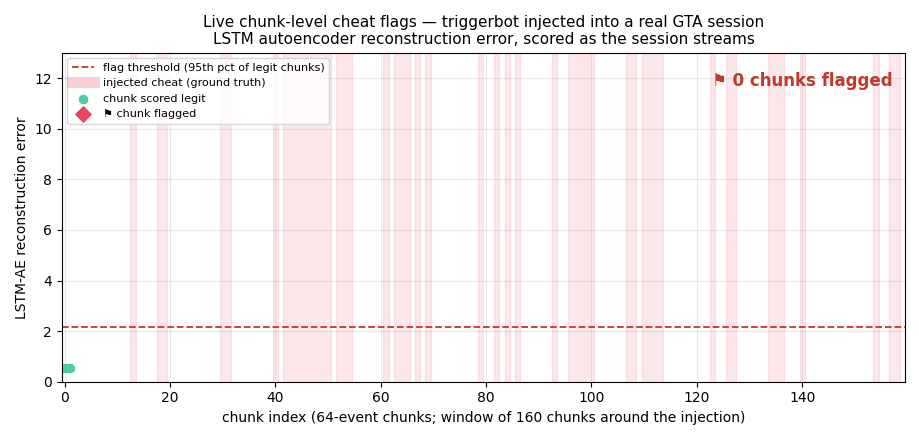
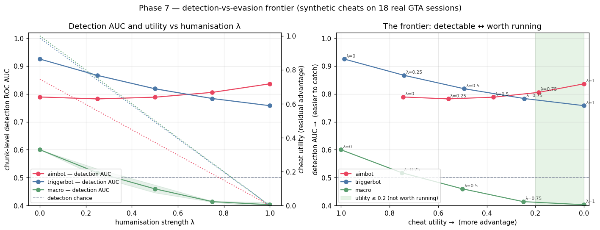

# BehaviorDNA 🎮🧬

> **Player behavioral biometrics from raw input telemetry.**
> Can we identify *who* is playing — or detect automation — purely from mouse and keyboard patterns?

[](https://github.com/Lo1s/behaviorDNA/actions/workflows/ci.yml)
[](https://dagshub.com/Lo1s/behaviorDNA)

---



*15 seconds of the system working: a **triggerbot injected into a real GTA session**, replayed chunk-by-chunk through the LSTM autoencoder. Shaded bands are the injected-cheat ground truth; diamonds are chunks the model flags (reconstruction error above the legit 95th percentile). Reproduce: `python -m scripts.build_phase4_demo --gif`.*

<!-- FUNNEL: drop the hosted Streamlit URL + video link here when live -->
**▶ See it yourself:** 🚀 **[Run the demo](docs/DEPLOY.md)** — `docker compose up` → dashboard at `:8501` (or one-click on Streamlit Cloud, see [DEPLOY.md](docs/DEPLOY.md)) · 📊 **[Results](#results-at-a-glance)** · 📜 **[The honest findings](docs/FINDINGS.md)**

---


*Chunk-level cheat detection — **synthetic cheats injected into 18 real GTA legit sessions** (the approach proof). The LSTM autoencoder's reconstruction error separates cheat chunks (coloured) from legit-behaviour chunks (green): triggerbot ROC AUC 0.94, aimbot 0.80, macro 0.61 — while hand-crafted window features stay at chance for aimbot. The approach is **also validated on real recorded cheats and on a second game (CS2)** — see [Results](#results-at-a-glance). Reproduce with `python -m scripts.build_phase4_demo`. See [docs/ADVERSARIAL.md](docs/ADVERSARIAL.md) and [docs/STREAMING.md](docs/STREAMING.md).*

> **Data status.** Measured on real GTA gameplay (18 legit sessions, 3 players) + real **recorded** cheats (a controllable offline harness, [docs/CHEAT_DATA_COLLECTION.md](docs/CHEAT_DATA_COLLECTION.md)) + an **external** CS2 cheat dataset. The chunk-level detector works on real data and transfers across games; the *session-level* live-risk aggregator saturates on the current single-recorder calibration set and is gated pending more (cross-player) data (Phase 4.1 — see [docs/STREAMING.md](docs/STREAMING.md#what-works-and-what-doesnt-honest)).

---



*The arms race ([Phase 7](docs/ADVERSARIAL.md#the-arms-race--detection-vs-evasion-phase-7)): a **humanisation knob λ** turns each cheat from "obvious bot" into one humanised toward the player's own play, and we plot detection vs the cheat's residual utility. The finding favours the defender — **no λ is both undetectable and worth running**: humanising the aimbot snap *raises* detection (jitter is more anomalous than a clean robotic snap), the triggerbot stays at AUC 0.76 even after its reaction edge is gone, and only the macro reaches chance — exactly when its perfect cadence (its entire value) is destroyed. Reproduce: `python -m scripts.evasion_frontier`.*

---

## Highlights — what this demonstrates

- **End-to-end MLOps on *real* data:** custom Windows telemetry recorder → DVC pipeline → training → calibration → drift monitoring → MLflow model registry → FastAPI + ONNX serving + Streamlit dashboard, all CI-tested (**340+ tests**).
- **Deep model where it earns its place:** a sequence autoencoder detects cheats hand-crafted features can't (triggerbot **0.94** chunk AUC vs aimbot **≈ chance** for window features) — and it **transfers to a second game** (Counter-Strike 2, ~0.72) on data I didn't create.
- **Honest validation over flattering numbers:** found, root-caused and **fixed a real ONNX serving-fidelity bug** (float32 precision flipping an overfit model's predictions — now a bit-faithful float64 export behind a CI regression gate, [finding #7](docs/FINDINGS.md)); *verified* (not assumed) a session-level detection ceiling before building on it; an **ablation** showing the model is over-parameterised at this N; an **architecture study** finding LSTM/TCN/Transformer statistically tied; every headline number ships with a **bootstrap CI**.
- **Anti-cheat framing throughout:** false-positive/ban-cost reasoning, calibrated probabilities (ECE/Brier), and deliberate, audited model promotion — see the **[Model Card](MODEL_CARD.md)**.

---

## Results at a glance

<!-- RESULTS:BEGIN — auto-generated by scripts/generate_results.py; edit the script, not this block -->

**Player identification** (behavioural biometric, real GTA, per 30 s window — 95% CIs from a 2000-resample window bootstrap; intervals are wide because the test set is 34 windows):

| Setting | Result |
|---|---|
| 3 players (real GTA) | **0.85** acc (95% CI 0.74–0.97) · 0.86 F1 (95% CI 0.75–0.97) |
| same-hardware pair *(no hardware confound)* | **0.75** acc (0.65 baseline, 95% CI 0.55–0.90; 20 test windows) — the honest biometric ([notebook 12](notebooks/12_explainability.ipynb)) |
| **Public corpus, 10 users (Balabit)** — *mouse-only, same pipeline* | **0.59** acc (95% CI 0.57–0.62, chance 0.10) · impostor-detection **EER 0.144** (784 labelled sessions) |
| **Public corpus, 120 users (SapiMouse)** — *scale stress-test* | 0.11 acc (chance 0.008 — 13× chance) from ~6 train windows/user; open-set ≈ chance → data-starved, the Phase-8 pretraining motivation |

**Cheat detection** — chunk-level ROC AUC of the LSTM autoencoder, three independent settings (hand-crafted window features ≈ 0.50 = chance for aimbot):

| Setting | Result |
|---|---|
| Synthetic cheats on real legit — *approach proof* | aimbot **0.80** · triggerbot **0.94** · macro 0.61 |
| **External game (CS2CD, 10 players, real cheats)** — *generalisation* | **0.72** |
| Own *recorded* real cheats (1 player) — *hardest, most honest* | aimbot 0.52 · triggerbot 0.60 · macro 0.57 |

LSTM-AE vs TCN-AE vs Transformer-AE are **statistically tied in every setting** → capacity isn't the bottleneck, data is ([ARCHITECTURE_COMPARISON.md](docs/ARCHITECTURE_COMPARISON.md)).

**Engineering:** ONNX export **bit-faithful** (probability MAE 1e-08, 100% label agreement — regression-gated in CI) · ONNX p50 **0.020 ms**/window (~222k windows/s) · sklearn p50 0.89 ms (~84k windows/s) · mock→real **drift 20/25 features** significant (KS+PSI) · MLflow registry + CI gates.

*Regenerated from `reports/*.json` by `python -m scripts.generate_results` — CI fails if this block is stale.*

<!-- RESULTS:END -->

🧭 **Start here:** **[Findings](docs/FINDINGS.md)** (the honest results in one page) → **[Model Card](MODEL_CARD.md)** (intended use, limits, ban-cost) → **[Threat Model](docs/THREAT_MODEL.md)** (what input biometrics can/can't see, and how each signal is evaded) → `notebooks/12_explainability.ipynb` (SHAP + per-channel attribution) → `notebooks/16_architecture_comparison.ipynb` (GPU-live LSTM/TCN/Transformer deep-dive + "is it the split or a real ceiling?" experiments) → `notebooks/17_identification_at_scale.ipynb` (10-player ID on CS2 + "does identity survive cheating?") → `notebooks/18_signal_importance_cs2.ipynb` (what signals to monitor — behavioural + non-behavioural — and which earn promotion) → `docs/ARCHITECTURE_COMPARISON.md` · `docs/SIGNALS.md`. *Numbers are directional at this data scale (one cheat recorder, 3 players), not production guarantees.*

---

## What is this?

BehaviorDNA is a game-agnostic ML system that:

1. **Collects** raw input telemetry (mouse, keyboard) during gameplay sessions
2. **Engineers** behavioral features — rhythm, timing, micro-jitter, reaction patterns
3. **Builds** per-player behavioral fingerprints across sessions
4. **Detects** anomalies and automation-like behavior (bots, macros, scripts)
5. **Identifies** players by their behavioral signature alone

Designed as a portfolio project demonstrating end-to-end MLOps — from data collection to deployed inference API.

---

## Architecture

Offline trains and versions the model artifacts; online serves them — the two
halves meet only at the recorder's session JSON (input) and `models/` (handoff).

```
   Windows host:  collector/  ──►  data/raw/   (session JSON, DVC-tracked:
                                                legit  +  cheat/)
                                       │
   ═══════════════ OFFLINE — DVC pipeline + MLflow ════════════════
                                       │
     ingestion ─► features ─► split ─► training ─► evaluation
                      │                LightGBM-id /     bootstrap CIs
                      ▼                IsolationForest,
                 sequences ─► models/  + ONNX export
                              LSTM-AE  (PyTorch)

     side-channels:  adversarial (synthetic cheats + benchmark) ·
                     external/ (public corpora) · calibration (isotonic) ·
                     monitoring/ (KS + PSI drift)
                                       │
                                       ▼
                  models/   ( .pkl · .onnx · .pt )     ◄── artifact handoff
                                       │
   ═══════════════ ONLINE — docker/ serving stack ═════════════════
                                       │
          ┌────────────────────────────┼────────────────────────────┐
          ▼                            ▼                            ▼
     api/main.py               api/streaming.py             dashboard/
     batch /predict/*          /stream WebSocket            Streamlit · 5 tabs
     (player · anomaly)        (inference engine +          (incl. live replay)
                                risk aggregator)
```

---

## Tech Stack

| Layer | Tools |
|---|---|
| Data collection | Python, `pynput` (Windows) |
| Data versioning | DVC |
| Experiment tracking | MLflow + DagsHub |
| Feature engineering | Pandas, NumPy |
| ML models | LightGBM, Scikit-learn (Isolation Forest), PyTorch (LSTM/AE) |
| Pipeline orchestration | DVC pipelines + GitHub Actions |
| Model export | ONNX |
| Inference / serving | FastAPI (batch `/predict/*` + `/stream` WebSocket) · Docker |
| Dashboard | Streamlit (5 tabs, incl. live session replay) |
| Monitoring | Feature/data drift (KS + PSI) · isotonic calibration |
| CI/CD | GitHub Actions |

---

## Project Structure

```
behaviorDNA/
├── collector/          # Windows input-telemetry recorder (session JSON)
├── pipeline/
│   ├── ingestion/      # Raw JSON → Parquet (sessions, events)
│   ├── features/       # 30s-window features + player-stratified split
│   ├── sequences/      # Raw event-tensor preprocessing (for the LSTM-AE)
│   ├── models/         # PyTorch LSTM autoencoder
│   ├── training/       # sklearn/LightGBM dispatch + ONNX export
│   ├── evaluation/     # Metrics, bootstrap CIs, confusion matrix
│   ├── adversarial/    # Synthetic-cheat injection + detection benchmark
│   ├── inference/      # Streaming engine + Naive-Bayes risk aggregator
│   ├── monitoring/     # Data/feature drift (KS + PSI)
│   ├── external/       # Public-corpus loaders (Balabit, SapiMouse, CS2CD)
│   └── calibration.py  # Isotonic probability calibration
├── api/                # FastAPI: batch /predict/* + /stream WebSocket
├── dashboard/          # Streamlit (5 tabs, incl. live session replay)
├── docker/             # Dockerfile + compose for the serving stack
├── notebooks/          # 01–19 analysis / tutorials
├── models/ configs/ scripts/ tests/ reports/ docs/
└── data/
    ├── raw/            # Session JSON — legit + cheat/ (DVC-tracked)
    ├── processed/      # Parquet feature tables (DVC-tracked)
    ├── splits/         # Player-stratified train/val/test (DVC-tracked)
    ├── external/       # Public datasets (DVC-tracked)
    └── synthetic/      # Generated cheat sessions (DVC-tracked)
```

---

## Quickstart

### 1. Clone & set up (WSL/Linux)

```bash
git clone https://github.com/Lo1s/behaviorDNA.git
cd behaviorDNA
python -m venv .venv
source .venv/bin/activate
pip install -r requirements.txt
```

### 2. Set up DVC remote (DagsHub)

```bash
dvc remote add origin https://dagshub.com/Lo1s/behaviorDNA.dvc
dvc pull
```

### 3. Configure MLflow credentials (optional)

Copy `.env.example` to `.env` and fill in your DagsHub credentials to enable experiment tracking:

```bash
cp .env.example .env
# edit .env — set MLFLOW_TRACKING_USERNAME and MLFLOW_TRACKING_PASSWORD
```

Training runs log automatically to DagsHub when credentials are present. Without `.env`, training still works — MLflow logging is silently skipped.

### 4. Record a session (Windows)

The recommended way is the compiled GUI (see `collector/recorder_gui.py` → PyInstaller). For CLI use:

```bash
# On Windows (native Python, not WSL)
cd collector
python record_session.py \
  --player your_name \
  --game gta \
  --activity combat \
  --polling-rate 1000 \
  --resolution 1920x1080 \
  --grip palm \
  --hand right \
  --warmup no \
  --sens 0.35 \
  --dpi 800
```

See [docs/RECORDING_INSTRUCTIONS.md](docs/RECORDING_INSTRUCTIONS.md) for the full player guide (activity schedule, how to look up hardware values, data quality rules).

### 5. Run the pipeline

```bash
dvc repro
```

### 6. Launch the dashboard

```bash
streamlit run dashboard/app.py
```

Opens at `http://localhost:8501` — five tabs: Overview, Player Profiles, Predict, Session Explorer, Live Session.

### 7. Or run the whole stack in Docker

```bash
docker compose up --build      # API → :8000 (/docs) · dashboard → :8501
```

API + dashboard from one image; mounts your local `models/` + `data/`, or
`dvc pull`s them with a DagsHub token. Hosted-demo (Streamlit Cloud) + deploy
notes: **[docs/DEPLOY.md](docs/DEPLOY.md)**.

---

## Roadmap

- [x] Project structure & repo setup
- [x] Data collector (Windows, pynput) — GUI + standalone .exe via PyInstaller
- [x] Ethics & safety documentation
- [x] Ingestion pipeline (JSON → Parquet)
- [x] Feature engineering module
- [x] Anomaly detection model (Isolation Forest / Autoencoder)
- [x] Player identification model (LightGBM)
- [x] MLflow experiment tracking
- [x] ONNX model export
- [x] FastAPI inference endpoint
- [x] Test suite (features, split, training, evaluation, API)
- [x] GitHub Actions CI/CD
- [x] DagsHub integration

---

## Portfolio Roadmap

A 5-phase roadmap targeting anti-cheat ML/AI roles is tracked in detail in [docs/ROADMAP.md](docs/ROADMAP.md). Current status:

| Phase | Goal | Status |
|---|---|---|
| 1. [Trajectory & temporal features](docs/ROADMAP.md#phase-1--trajectory--temporal-features) | 7 anti-cheat-targeted window features | ✅ Done — triggerbot AUC 0.50 → 0.87, macro 0.55 → 0.68 |
| 1.5. [Feature expansion](docs/ROADMAP.md#phase-15--feature-expansion-optional) | Further window-feature ideas | 📝 Backlog — gate resolved: deferred on ablation evidence; 5 CS2CD-validated features promoted instead, ID/cheat feature sets decoupled ([docs/SIGNALS.md](docs/SIGNALS.md)) |
| 2. [LSTM autoencoder](docs/LSTM_AE.md) | Deep-learning sequence model on raw events | ✅ Done — real-data aimbot chunk AUC **0.80**, triggerbot **0.94** |
| 3. [Adversarial bots](docs/ADVERSARIAL.md) | Synthetic cheat generator + detection benchmark | ✅ Done — 90 labelled hybrid sessions, full ROC grid |
| 4. [Streaming + risk aggregation](docs/STREAMING.md) | Naive-Bayes log-odds aggregator + WebSocket API + live dashboard tab | ✅ Infra done; session-level aggregator saturates on real data → Phase 4.1 (see [doc](docs/STREAMING.md#what-works-and-what-doesnt-honest)) |
| 4.1. [Live recorder + aggregator redesign](docs/ROADMAP.md#phase-41--live-recorder--multi-user-backlog) | Aggregator redesign (needs real continuous-cheat data), live recorder, WS auth | 📝 Backlog — data-gated |
| 5. [Statistical rigor & MLOps](docs/ROADMAP.md#phase-5--statistical-rigor--mlops-polish) | SHAP, calibration, drift, registry | ✅ Done (5a–5e) — [docs/MLOPS.md](docs/MLOPS.md) |

Legend: ✅ Done · 🚧 In progress · ⬜ Not started · 📝 Backlog

## TODO / Research Directions

- [x] **External dataset exploration** — CS2CD cheat detection + CaptchaSolve30k mouse kinematic analysis (`notebooks/05_external_datasets.ipynb`)
- [x] **Multi-model comparison** — benchmark RandomForest, XGBoost, SVC vs LightGBM for identification; LOF, One-Class SVM vs IsolationForest for detection (`notebooks/06_model_comparison.ipynb`)
- [x] **Promote best models to pipeline** — RandomForest, XGBoost, SVC, LOF, OneClassSVM now selectable via `configs/training.yaml`
- [x] **Behavioral differentiation analysis** — deep dive into how cheater/bot trajectories differ from legit behavior using CS2CD and CaptchaSolve30k (`notebooks/07_behavioral_differentiation.ipynb`)
- [x] **Adversarial bot generation + detection benchmark** — synthetic aimbot/triggerbot/macro generator, 90 labelled hybrid sessions, per-detector ROC grid (`notebooks/10_adversarial_bots.ipynb`, `docs/ADVERSARIAL.md`)
- [x] **Trajectory & temporal features** — 7 anti-cheat-targeted features (curvature, path efficiency, click reaction time, keystroke periodicity, …) closing the triggerbot + macro detection gap (`notebooks/08_trajectory_features.ipynb`, `docs/FEATURES.md`)
- [x] **LSTM autoencoder on raw event sequences** — PyTorch sequence model, GPU-accelerated (RTX 3070), solves the aimbot detection gap at the chunk level (real-data AUC 0.79). 11-step tutorial in `notebooks/09_lstm_autoencoder.ipynb`; full architecture write-up in `docs/LSTM_AE.md`
- [x] **Streaming inference + Bayesian session aggregation** — `/stream` WebSocket endpoint, `pipeline/inference/aggregator.py` (Naive-Bayes log-odds + isotonic calibration), `scripts/replay_session.py` with synthetic-cheat injection, "📡 Live Session" dashboard tab, reproducible PNG + GIF demo artifacts via `scripts/build_phase4_demo.py`. Full architecture in [docs/STREAMING.md](docs/STREAMING.md).
- [x] **Calibration + SHAP + drift monitor + MLflow registry** — production polish (Phase 5; see [docs/MLOPS.md](docs/MLOPS.md))
- [x] **Real-time dashboard** — five-tab Streamlit app in `dashboard/app.py`

---

## Why this project?

Built as a portfolio piece targeting the behavioral biometrics / anti-cheat domain.
Demonstrates: data engineering, feature design, MLOps pipelines, model deployment — not just a notebook.

---

## Ethics & safety

This project operates entirely at the OS input level — no game memory reading, no packet sniffing, no anti-cheat bypass. All data is collected with explicit participant consent for research purposes.

See [docs/ETHICS.md](docs/ETHICS.md) for full details on data collection methodology, anti-cheat compatibility per game, consent process, and data privacy.
