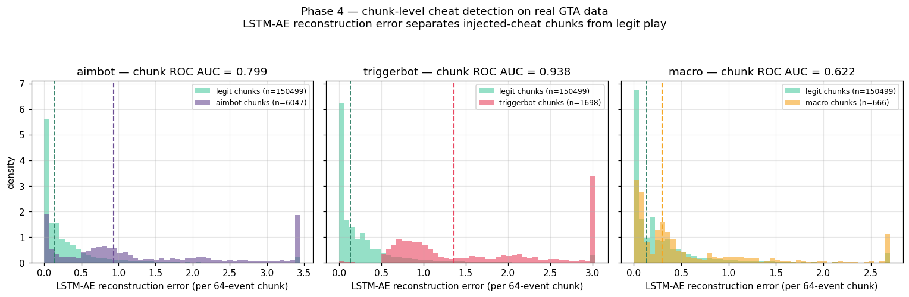

# BehaviorDNA 🎮🧬

> **Player behavioral biometrics from raw input telemetry.**
> Can we identify *who* is playing — or detect automation — purely from mouse and keyboard patterns?

[](https://github.com/Lo1s/behaviorDNA/actions/workflows/ci.yml)
[](https://dagshub.com/Lo1s/behaviorDNA)

---



*Chunk-level cheat detection on **18 real GTA sessions** (3 players). The LSTM autoencoder's reconstruction error separates injected-cheat chunks (coloured) from legit-behaviour chunks (green): triggerbot ROC AUC 0.94, aimbot 0.80, macro 0.61 — while hand-crafted window features stay at chance for aimbot. Reproduce with `python -m scripts.build_phase4_demo`. See [docs/ADVERSARIAL.md](docs/ADVERSARIAL.md) and [docs/STREAMING.md](docs/STREAMING.md).*

> **Data status.** Headline numbers are now measured on real GTA gameplay (18 sessions, 3 players). The chunk-level detector works on real data; the *session-level* live-risk aggregator saturates on the current 18-session calibration set and is being reworked (Phase 4.1 — see [docs/STREAMING.md](docs/STREAMING.md#what-works-and-what-doesnt-honest)).

---

## Results at a glance

| Task | Result | Notes |
|---|---|---|
| Player ID — 3 players (real) | **0.853** acc / 0.862 F1 | per 30 s window |
| Player ID — same-hardware pair | **0.75** acc | honest biometric (no hardware confound; 0.65 baseline) |
| Cheat detection — triggerbot | **0.93** chunk ROC AUC | LSTM autoencoder |
| Cheat detection — aimbot | **0.79** chunk ROC AUC | hand-crafted window features ≈ 0.50 (chance) |
| Mock → real drift | **20 / 25** features significant | KS + PSI |
| Inference (sklearn, CPU) | **1.4 ms**/window · ~89k windows/s | real-time at one window per 30 s |

📋 **[Model Card](MODEL_CARD.md)** · 🔬 **[Findings](docs/FINDINGS.md)** — the honest results, limitations (small-N over-parameterisation, session-level ceiling, an ONNX-export bug caught by validation), and what each means for anti-cheat. *Numbers are directional at N=18 sessions, not production guarantees.*

---

## What is this?

BehaviorDNA is a game-agnostic ML system that:

1. **Collects** raw input telemetry (mouse, keyboard) during gameplay sessions
2. **Engineers** behavioral features — rhythm, timing, micro-jitter, reaction patterns
3. **Builds** per-player behavioral fingerprints across sessions
4. **Detects** anomalies and automation-like behavior (bots, macros, scripts)
5. **Identifies** players by their behavioral signature alone

Designed as a portfolio project demonstrating end-to-end MLOps — from data collection to deployed inference API.

---

## Architecture

```
┌─────────────────────────────────────────────────────────┐
│                   Windows (Gaming Host)                  │
│  ┌─────────────────────────────────────────────────┐    │
│  │  collector/  — lightweight input listener        │    │
│  │  outputs session JSON → data/raw/               │    │
│  └─────────────────────────────────────────────────┘    │
└──────────────────────────┬──────────────────────────────┘
                           │ sync / copy
┌──────────────────────────▼──────────────────────────────┐
│                   WSL / Linux (Dev)                      │
│                                                          │
│  pipeline/ingestion/   raw JSON → Parquet               │
│  pipeline/features/    feature engineering               │
│  pipeline/training/    model training (LightGBM, AE)    │
│  pipeline/evaluation/  metrics, reports                  │
│                                                          │
│  models/               saved model artifacts             │
│  api/                  FastAPI inference endpoint        │
│  dashboard/            MLflow / visualization            │
└─────────────────────────────────────────────────────────┘
```

---

## Tech Stack

| Layer | Tools |
|---|---|
| Data collection | Python, `pynput` (Windows) |
| Data versioning | DVC |
| Experiment tracking | MLflow + DagsHub |
| Feature engineering | Pandas, NumPy |
| ML models | LightGBM, Scikit-learn (Isolation Forest), PyTorch (LSTM/AE) |
| Pipeline orchestration | DVC pipelines + GitHub Actions |
| Model export | ONNX |
| Inference API | FastAPI |
| CI/CD | GitHub Actions |

---

## Project Structure

```
behaviorDNA/
├── collector/          # Windows-side input telemetry recorder
├── pipeline/
│   ├── ingestion/      # Raw JSON → structured Parquet
│   ├── features/       # Feature extraction & engineering
│   ├── training/       # Model training scripts
│   └── evaluation/     # Metrics, reports, comparison
├── models/             # Saved model artifacts (.pkl, .onnx)
├── api/                # FastAPI inference service
├── dashboard/          # Visualization & MLflow helpers
├── configs/            # Hydra / YAML configuration
├── scripts/            # Utility & setup scripts
├── tests/              # Unit & integration tests
├── docs/               # Architecture diagrams, notes
└── data/
    ├── raw/            # Raw session JSON files (DVC-tracked)
    ├── processed/      # Parquet feature tables (DVC-tracked)
    └── splits/         # Train/val/test splits (DVC-tracked)
```

---

## Quickstart

### 1. Clone & set up (WSL/Linux)

```bash
git clone https://github.com/YOUR_USERNAME/behaviorDNA.git
cd behaviorDNA
python -m venv .venv
source .venv/bin/activate
pip install -r requirements.txt
```

### 2. Set up DVC remote (DagsHub)

```bash
dvc remote add origin https://dagshub.com/YOUR_USERNAME/behaviorDNA.dvc
dvc pull
```

### 3. Configure MLflow credentials (optional)

Copy `.env.example` to `.env` and fill in your DagsHub credentials to enable experiment tracking:

```bash
cp .env.example .env
# edit .env — set MLFLOW_TRACKING_USERNAME and MLFLOW_TRACKING_PASSWORD
```

Training runs log automatically to DagsHub when credentials are present. Without `.env`, training still works — MLflow logging is silently skipped.

### 4. Record a session (Windows)

The recommended way is the compiled GUI (see `collector/recorder_gui.py` → PyInstaller). For CLI use:

```bash
# On Windows (native Python, not WSL)
cd collector
python record_session.py \
  --player your_name \
  --game gta \
  --activity combat \
  --polling-rate 1000 \
  --resolution 1920x1080 \
  --grip palm \
  --hand right \
  --warmup no \
  --sens 0.35 \
  --dpi 800
```

See [docs/RECORDING_INSTRUCTIONS.md](docs/RECORDING_INSTRUCTIONS.md) for the full player guide (activity schedule, how to look up hardware values, data quality rules).

### 5. Run the pipeline

```bash
dvc repro
```

### 6. Launch the dashboard

```bash
streamlit run dashboard/app.py
```

Opens at `http://localhost:8501` — four tabs: Overview, Player Profiles, Predict, Session Explorer.

### 7. Or run the whole stack in Docker

```bash
docker compose up --build      # API → :8000 (/docs) · dashboard → :8501
```

API + dashboard from one image; mounts your local `models/` + `data/`, or
`dvc pull`s them with a DagsHub token. Hosted-demo (Streamlit Cloud) + deploy
notes: **[docs/DEPLOY.md](docs/DEPLOY.md)**.

---

## Roadmap

- [x] Project structure & repo setup
- [x] Data collector (Windows, pynput) — GUI + standalone .exe via PyInstaller
- [x] Ethics & safety documentation
- [x] Ingestion pipeline (JSON → Parquet)
- [x] Feature engineering module
- [x] Anomaly detection model (Isolation Forest / Autoencoder)
- [x] Player identification model (LightGBM)
- [x] MLflow experiment tracking
- [x] ONNX model export
- [x] FastAPI inference endpoint
- [x] Test suite (features, split, training, evaluation, API)
- [x] GitHub Actions CI/CD
- [x] DagsHub integration

---

## Portfolio Roadmap

A 5-phase roadmap targeting anti-cheat ML/AI roles is tracked in detail in [docs/ROADMAP.md](docs/ROADMAP.md). Current status:

| Phase | Goal | Status |
|---|---|---|
| 1. [Trajectory & temporal features](docs/ROADMAP.md#phase-1--trajectory--temporal-features) | 7 anti-cheat-targeted window features | ✅ Done — triggerbot AUC 0.50 → 0.87, macro 0.55 → 0.68 |
| 1.5. [Feature expansion (backlog)](docs/ROADMAP.md#phase-15--feature-expansion-optional) | Further window-feature ideas | 📝 Backlog |
| 2. [LSTM autoencoder](docs/LSTM_AE.md) | Deep-learning sequence model on raw events | ✅ Done — real-data aimbot chunk AUC **0.79**, triggerbot **0.93** |
| 3. [Adversarial bots](docs/ADVERSARIAL.md) | Synthetic cheat generator + detection benchmark | ✅ Done — 90 labelled hybrid sessions, full ROC grid |
| 4. [Streaming + risk aggregation](docs/STREAMING.md) | Naive-Bayes log-odds aggregator + WebSocket API + live dashboard tab | ⚠️ Infra end-to-end; session-level aggregator saturates on real data → Phase 4.1 (see [doc](docs/STREAMING.md#what-works-and-what-doesnt-honest)) |
| 4.1. [Live recorder + multi-user backlog](docs/ROADMAP.md#phase-41--live-recorder--multi-user-backlog) | Phase 4 follow-ups | 📝 Backlog |
| 5. [Statistical rigor & MLOps](docs/ROADMAP.md#phase-5--statistical-rigor--mlops-polish) | SHAP, calibration, drift, registry | ⬜ Not started |

Legend: ✅ Done · 🚧 In progress · ⬜ Not started · 📝 Backlog

## TODO / Research Directions

- [x] **External dataset exploration** — CS2CD cheat detection + CaptchaSolve30k mouse kinematic analysis (`notebooks/05_external_datasets.ipynb`)
- [x] **Multi-model comparison** — benchmark RandomForest, XGBoost, SVC vs LightGBM for identification; LOF, One-Class SVM vs IsolationForest for detection (`notebooks/06_model_comparison.ipynb`)
- [x] **Promote best models to pipeline** — RandomForest, XGBoost, SVC, LOF, OneClassSVM now selectable via `configs/training.yaml`
- [x] **Behavioral differentiation analysis** — deep dive into how cheater/bot trajectories differ from legit behavior using CS2CD and CaptchaSolve30k (`notebooks/07_behavioral_differentiation.ipynb`)
- [x] **Adversarial bot generation + detection benchmark** — synthetic aimbot/triggerbot/macro generator, 90 labelled hybrid sessions, per-detector ROC grid (`notebooks/10_adversarial_bots.ipynb`, `docs/ADVERSARIAL.md`)
- [x] **Trajectory & temporal features** — 7 anti-cheat-targeted features (curvature, path efficiency, click reaction time, keystroke periodicity, …) closing the triggerbot + macro detection gap (`notebooks/08_trajectory_features.ipynb`, `docs/FEATURES.md`)
- [x] **LSTM autoencoder on raw event sequences** — PyTorch sequence model, GPU-accelerated (RTX 3070), solves the aimbot detection gap at the chunk level (real-data AUC 0.79). 11-step tutorial in `notebooks/09_lstm_autoencoder.ipynb`; full architecture write-up in `docs/LSTM_AE.md`
- [x] **Streaming inference + Bayesian session aggregation** — `/stream` WebSocket endpoint, `pipeline/inference/aggregator.py` (Naive-Bayes log-odds + isotonic calibration), `scripts/replay_session.py` with synthetic-cheat injection, "📡 Live Session" dashboard tab, reproducible PNG + GIF demo artifacts via `scripts/build_phase4_demo.py`. Full architecture in [docs/STREAMING.md](docs/STREAMING.md).
- [ ] **Calibration + SHAP + drift monitor + MLflow registry** — production polish (Phase 5)
- [x] **Real-time dashboard** — four-tab Streamlit app in `dashboard/app.py`

---

## Why this project?

Built as a portfolio piece targeting the behavioral biometrics / anti-cheat domain.
Demonstrates: data engineering, feature design, MLOps pipelines, model deployment — not just a notebook.

---

## Ethics & safety

This project operates entirely at the OS input level — no game memory reading, no packet sniffing, no anti-cheat bypass. All data is collected with explicit participant consent for research purposes.

See [docs/ETHICS.md](docs/ETHICS.md) for full details on data collection methodology, anti-cheat compatibility per game, consent process, and data privacy.
